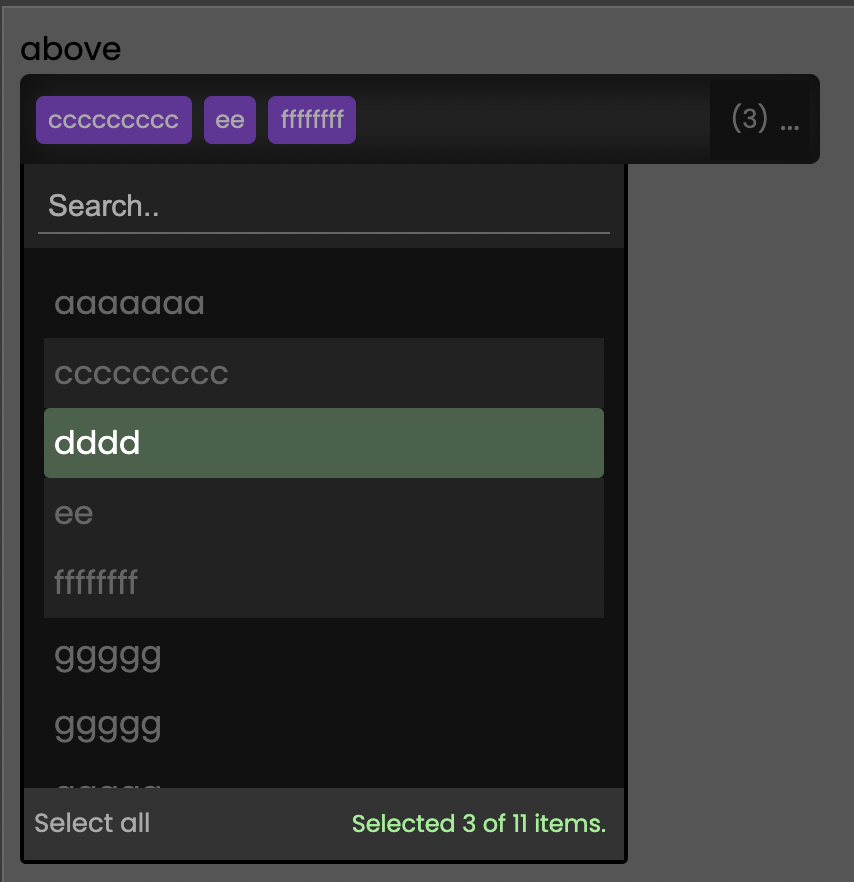

# Rich dropdown like a boss 🚀



## Features

* Supports multiple instances.
* Use a custom component to render each list item.
* Uses Observables for data source changes and event tracking.
* Use a default (light/dark) theme or customize to your liking.
* Escape key closes the dropdown.
* Programmatically manage dropdown states.
* Configure every aspect of the dropdown component per instance.
* Search and filter against all data source object properties.

## Installation

```bash
npm install @ngstudio/dropdown
```

## Example

```typescript
const instance = this.dropdownService.open('one', 'myElementId', this.one, {

    name: 'one',
    rowComponentType: DataRowComponent,
    rowComponentPropertyName: 'data',
    closeAfterSelect: false,
    theme: DropdownThemes.dark,
    data$,
    selectedRenderFn: (item: any) => {

        return item[ 'firstname' ];

    },
    componentConfig: {

        top: {

            show: true

        },

        bottom: {

            show: true

        }

    }

});

instance.selected$.subscribe(selected => {

    console.log(selected);

});

}
```
